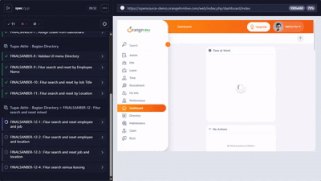

# 🧪 SANBERCODE QA ENGINEER BATCH 71 - FINAL PROJECT

This project contains **end-to-end (E2E) test automation** for the [OrangeHRM Demo Application](https://opensource-demo.orangehrmlive.com/) using **Cypress**.  
The tests cover the **Login**, **Dashboard**, and **Directory** modules.


<p align="center">
  
</p>


---

## 📁 Project Structure

```
cypress/
├── e2e/
│   └── spec.cy.js              # Main test file (this file)
├── support/
│   ├── doClass.js              # Custom helper functions (login, logout, etc.)
│   ├── navTo.js                # Navigation helpers
│   ├── directory.js            # Directory page helpers
│   └── leave.js                # Leave management helpers
```

---

## ⚙️ Setup Instructions

### 1. Install Dependencies
```bash
npm install
```

### 2. Open Cypress Test Runner
```bash
npx cypress open
```

---

## 🌐 Target Application

- **Base URL:** `https://opensource-demo.orangehrmlive.com`
- **Modules Tested:** Login, Dashboard, Directory
- **Test Framework:** [Cypress.io](https://www.cypress.io/)

---

## 🧭 Test Scenarios Overview

### 🔐 **Login Module**

| ID | Test Case | Description | Expected Result |
|----|------------|--------------|-----------------|
| FINALSANBER-1 | Login (valid credentials) | Login with correct username & password | Redirects to Dashboard successfully |
| FINALSANBER-2 | Login (invalid credentials) | Login with incorrect username & password | Shows “Invalid credentials” message |
| FINALSANBER-3 | Forgot Password | Uses forgot password feature | Displays reset confirmation message |
| FINALSANBER-4 | Logout | Logs out after successful login | Returns to Login page with status 302 |

---

### 🏠 **Dashboard Module**

| ID | Test Case | Description | Expected Result |
|----|------------|--------------|-----------------|
| FINALSANBER-5 | Navbar Search | Search for “Admin”, “Dashboard”, “Directory” | Menu items found and displayed |
| FINALSANBER-6 | Validate Dashboard Cards | Verify all dashboard widget labels | All widget titles are correct |
| FINALSANBER-7 | Assign Leave | Assign leave via “Quick Launch” card | Displays success toast “Successfully Saved” |

---

### 📇 **Directory Module**

| ID | Test Case | Description | Expected Result |
|----|------------|--------------|-----------------|
| FINALSANBER-8 | UI Validation | Verify directory form elements and visibility toggle | Labels visible/hidden correctly |
| FINALSANBER-9 | Search by Employee Name | Search and reset by employee name | Correct employee appears in result |
| FINALSANBER-10 | Search by Job Title | Search and reset by job title | Results filtered by job title |
| FINALSANBER-11 | Search by Location | Search and reset by location | Results filtered by location |
| FINALSANBER-12-1 | Mixed: Employee + Job | Search by employee and job | Correct record displayed |
| FINALSANBER-12-2 | Mixed: Employee + Location | Search by employee and location | Correct record displayed |
| FINALSANBER-12-3 | Mixed: Job + Location | Search by job and location | Correct record displayed |
| FINALSANBER-12-4 | Empty Search | No filters applied | Displays list of all employees |

---

## 🧰 Utilities & Custom Commands

- `cy.login()` → Log in to the application 
- `Do.loginPage()` → Navigate to login page  
- `Do.forgotPass(username)` → Trigger forgot password  
- `Do.logOut()` → Log out of the application  
- `navTo.directory()` → Navigate to Directory module  
- `directory.employeeName()`, `directory.job()`, `directory.location()` → Apply search filters  
- `directory.search()`, `directory.reset()` → Execute or reset search  
- `leave.name()`, `leave.type()`, `leave.date()` → Assign leave workflow  

---

## ✅ Assertions & Validations

- API Response status codes (`200`, `302`) are validated via `cy.intercept()`  
- UI assertions check visibility, text content, and URL redirects  
- Toast and dialog confirmations verify successful actions  

---

## 🧾 Notes

- Each test is independent and can be executed standalone  
- Uses the **OrangeHRM public demo site**, which resets periodically
- Date on assign leave from dashboard can not be same date
